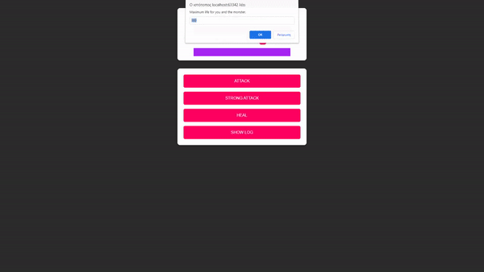

<div align="right">
  
  </a>
</div>

# Udemy Project: Monster Killer Project
This is a hands-on project from the Udemy course - Beginner JavaScript. Create a Monster Killer Project game by Maximilian Schwarzmüller.

# Demo

<div align="center">
  
</div>

You can run the demo on your local machine, please follow the instructions in [Getting Started](#getting-started).

# Technologies

- [JavaScript](https://www.javascript.com/)
- [HTML5](https://html.com/)
- [CSS](https://web.dev/learn/css/)

# Getting Started

Follow the instructions below to set up the environment and run this project on your local machine.

1. Clone this repository.

```bash
# Clone repository
$ git clone https://github.com/ViniUK00/Monster_Killer_Project.git
```
